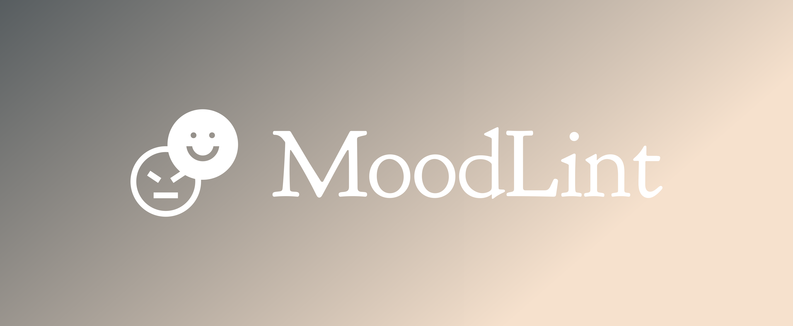

<div>

<div align="center">
    
<p>Emotion-Based Debugging Extension for Visual Studio Code</p>

</div>
</div>
</div>

<div align="center">
  


</div>

MoodLint is a Visual Studio Code extension designed to enhance the debugging experience by integrating real-time emotion analysis with tailored debugging suggestions and artistic code visualizations powered by a Generative Adversarial Network (GAN). But why is such a tool necessary? Research, such as the study "Do Moods Affect Programmers’ Debug Performance?" by Khan, Brinkman, and Hierons (2011), provides compelling evidence that programmers’ emotional states significantly influence their debugging performance. Below, we explore this connection and explain why a mood-based debugging tool like MoodLint addresses a critical need for developers.

## Why MoodLint exist?

Debugging is a critical part of software development, requiring intense focus, problem-solving skills, and patience to identify and fix errors in code. A programmer’s mood—whether they are stressed, frustrated, anxious, or calm—can directly affect how well they perform this task. Here’s why:

Negative Moods and Cognitive Impact: When a programmer is in a bad mood, such as feeling frustrated after hours of chasing a bug, their ability to concentrate may diminish. Stress or anxiety can lead to tunnel vision, where they fixate on a single approach (even if it’s ineffective) or overlook obvious solutions. For example, a stressed programmer might repeatedly tweak the same section of code without stepping back to consider the broader system, prolonging the debugging process.
Positive Moods and Creativity: Conversely, a positive or calm mood can enhance creativity and flexibility. A programmer who feels relaxed or confident might approach a bug with fresh perspectives, experimenting with alternative solutions or spotting patterns that a frustrated programmer might miss. This suggests that mood doesn’t just affect speed—it can influence the quality of the debugging outcome.
Emotional Fatigue: Debugging often involves dealing with complex, elusive problems that can wear down a programmer over time. Emotional fatigue from prolonged debugging sessions can reduce attention to detail, increasing the likelihood of errors or incomplete fixes. Recognizing mood could help mitigate this by prompting breaks or adjustments in approach.

## The Link Between Mood and Debugging Performance

Source: <https://link.springer.com/article/10.1007/s10111-010-0164-1>

1. Experiment 1: Mood Induction via Movie Clips
Setup: 72 programmers watched short movie clips designed to induce specific moods (e.g., high arousal, low arousal, positive valence, negative valence) before completing a debugging test.
Findings: The clips significantly affected debugging performance, with arousal levels playing a key role. Programmers in high-arousal states (e.g., after watching exciting clips) outperformed those in low-arousal states (e.g., after calming clips). The number of tasks completed within a time limit was notably higher in high-arousal conditions (4.59 tasks vs. 3.03 in low arousal). However, the effect of valence (positive vs. negative mood) was less conclusive due to sample size limitations.

2. Experiment 2: Mood Manipulation via Physical Activity
Setup: 19 programmers performed a monotonous algorithm-tracing task for 16 minutes to induce boredom (low arousal), followed by physical exercises to boost arousal and positivity, and then continued tracing.
Findings: After the exercises, both arousal and valence increased significantly, and debugging performance improved, particularly in producing correct outputs. The effect was temporary, suggesting that mood interventions can provide short-term boosts.
Key Takeaway: Mood, especially arousal (the level of activation or energy), directly influences debugging efficiency. High arousal enhances performance, while low arousal—often linked to boredom or fatigue—hinders it. Valence (positivity vs. negativity) may also play a role, though its impact is less clear from the study.

## Why MoodLint Addresses This Need

Programmers face emotional fluctuations during coding—frustration from persistent bugs, fatigue from long sessions, or focus during productive streaks. The research suggests that these states aren’t just background noise; they actively shape debugging outcomes. MoodLint leverages this insight with three innovative features:

1. Real-Time Emotion Detection
How It Works:
Using deep learning, MoodLint analyzes a programmer’s emotional state—detecting frustration, focus, or fatigue—through inputs like typing patterns, facial expressions (if webcam-enabled), or other behavioral cues.

Why It’s Needed:
Studies indicate that low arousal impairs debugging performance, resulting in fewer tasks completed or fewer correct outputs. By identifying suboptimal states (e.g., boredom or fatigue), MoodLint can intervene before performance declines. For example, it might flag a low-arousal state as a risk factor and prompt corrective action.

2. Tailored Debugging Suggestions
How It Works:
Based on the detected mood, MoodLint adjusts its debugging advice. For frustrated programmers, it simplifies suggestions or breaks problems into smaller steps. For focused programmers, it offers advanced insights.

Why It’s Needed:
Mood affects cognitive processes like reasoning and attention, which are critical for debugging. Frustrated programmers may miss obvious errors due to narrowed focus, while fatigued ones may lack the energy to trace complex logic. Tailored suggestions improve efficiency and reduce errors by aligning support with the programmer’s current state.

3. Artistic Code Visualizations with GANs
How It Works:
MoodLint uses GANs (Generative Adversarial Networks) to create animated, artistic representations of code structure, making abstract concepts visually engaging.

Why It’s Needed:
Monotony can lower arousal and decrease performance. Visualizations help counter this by making debugging more stimulating and enjoyable. Positive moods are linked to increased creativity, enabling programmers to approach bugs with fresh perspectives.

## Agent popup

```sh

python3 popup/agent_popup.py <path_to_code_file> <filename> <mood> [optional_query]

python3 popup/agent_popup.py ./agents/workflow.py workflow.py happy

```

## Features

MoodLint redefines debugging and code comprehension by aligning technical assistance with your emotional state and visual learning preferences. Below are its core features, each accompanied by detailed descriptions and placeholders for illustrative screenshots:

- **Emotion Detection**
  - **Description**: MoodLint employs Deep learning model to analyze your webcam feed or typing patterns, detecting emotions such as frustration, focus, or relaxation in real time. This feature forms the backbone of MoodLint's ability to adapt debugging support to your current mood.

- **Tailored Debugging Suggestions**
  - **Description**: Based on your detected emotional state, MoodLint offers personalized debugging tips. For example, if frustration is sensed, it might suggest simplifying a complex function or stepping away briefly, while a focused state could prompt deeper code optimization recommendations.

- **Mood Dashboard**
  - **Description**: A visual tool displaying your emotional trends over time, helping you identify patterns (e.g., frequent frustration during late-night coding) and adjust your habits for better productivity and mental health.

- **Integration with VSCode Debugger**
  - **Description**: MoodLint enhances VSCode’s native debugging tools by overlaying emotion-driven insights, such as highlighting error-prone areas when stress is detected, making debugging more intuitive and effective.

- **Graph/Visualization Generation Using GAN**
  - **Description**: MoodLint incorporates a GAN trained from scratch to generate artistic, animated visualizations of your code structure (e.g., flowcharts or abstract syntax trees). Users can trigger this feature with a button, receiving two unique, stylized graphs that enhance code comprehension. The GAN learns from artistic datasets, applying styles like impressionism or abstract patterns to static graphs parsed from your code.

## Requirements

To harness MoodLint’s full potential, ensure your environment meets the following prerequisites. This section provides detailed installation and configuration steps:

- **Visual Studio Code**
  - **Version**: 1.60.0 or higher for compatibility with MoodLint’s features.
  - **Installation**: Download from [code.visualstudio.com](https://code.visualstudio.com/) and verify with `code --version`.

- **Node.js**
  - **Version**: 14.x or later, required for extension development and runtime.
  - **Installation**: Install from [nodejs.org](https://nodejs.org/), then confirm with `node -v`.

- **Python**
  - **Version**: 3.8 or later, essential for the local Python server powering emotion detection and GAN generation.
  - **Installation**: Get it from [python.org](https://www.python.org/), ensuring `pip` is included. Verify with `python --version` or `python3 --version`.

- **Dependencies**
  - **Setup**: Navigate to the `MOODLINT` root folder and run `npm install` to install Node.js dependencies, populating the `node_modules` folder. For Python dependencies, install the following:

    ```bash
    pip install fastapi uvicorn opencv-python deepface tensorflow numpy pillow graphviz

For example:

This extension contributes the following settings:

- `myExtension.enable`: Enable/disable this extension.
- `myExtension.thing`: Set to `blah` to do something.

## Release Notes

### 1.0.0

Initial release of ...

### 1.0.1

Fixed issue #.

### 1.1.0

Added features X, Y, and Z.

---

## Following extension guidelines

Ensure that you've read through the extensions guidelines and follow the best practices for creating your extension.

- [Extension Guidelines](https://code.visualstudio.com/api/references/extension-guidelines)

## Working with Markdown

You can author your README using Visual Studio Code. Here are some useful editor keyboard shortcuts:

- Split the editor (`Cmd+\` on macOS or `Ctrl+\` on Windows and Linux).
- Toggle preview (`Shift+Cmd+V` on macOS or `Shift+Ctrl+V` on Windows and Linux).
- Press `Ctrl+Space` (Windows, Linux, macOS) to see a list of Markdown snippets.

## For more information

- [Visual Studio Code's Markdown Support](http://code.visualstudio.com/docs/languages/markdown)
- [Markdown Syntax Reference](https://help.github.com/articles/markdown-basics/)

**Enjoy!**
